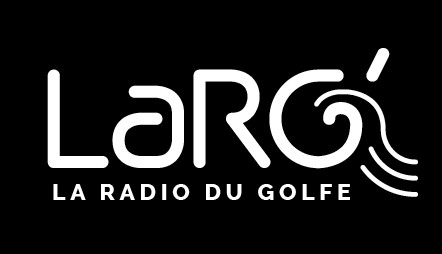

# LaRG La radio du golfe

Vous pouvez écouter LaRG sur [http://www.larg.fr](http://www.larg.fr)

**larg-atelier** permet de documenter toute la technique de la radio associative LaRG.

## Le présentateur

La documentation pour les présentateurs des émission [Ici](presentateur/presentateur.md).

## La technique

La documentation pour les techniciens des émission [Ici](technique/technique.md).

## Administration machine

La documentation pour les techniciens materiel de la radio [Ici](machine/machine.md).

## Documentation

Un petit guide pour participer à la documentation de **larg-atelier** [Ici](documentation/documentation_larg.md)
